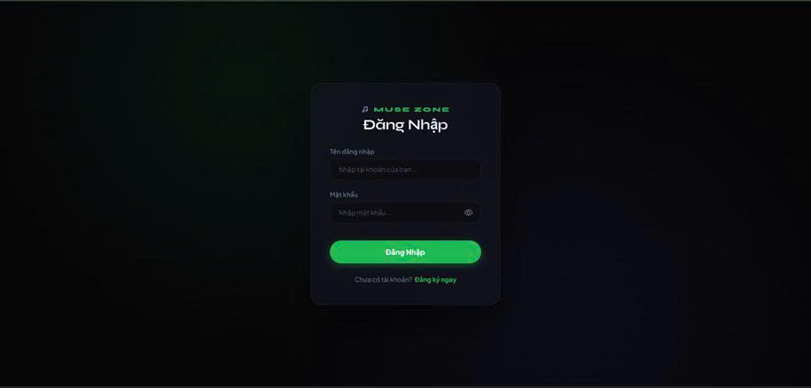
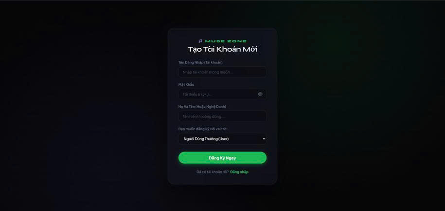
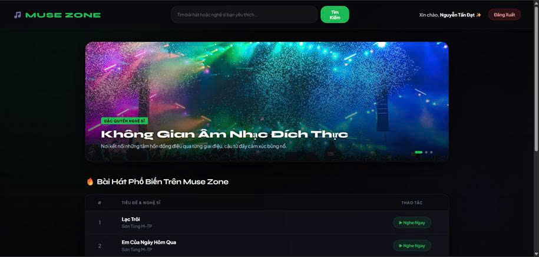
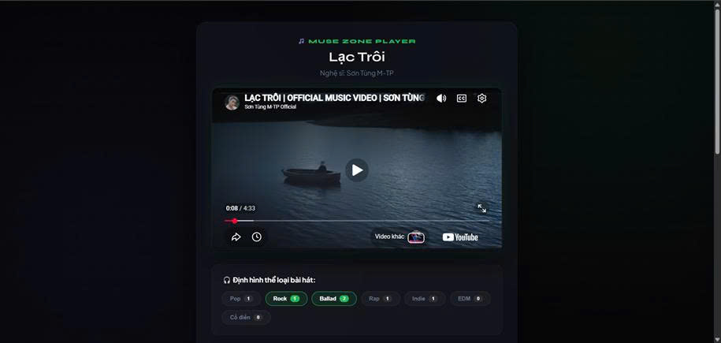
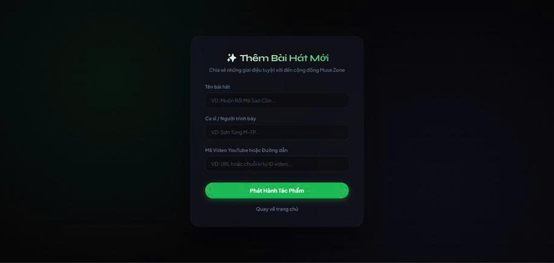
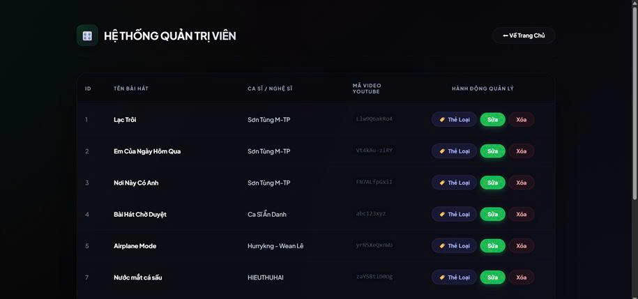

# 🎵 Nền Tảng Phát Nhạc Trực Tuyến (Muse Zone)
## Link demo dự án : 
👉 [Bấm vào đây để xem video demo dự án]([https://drive.google.com/file/d/1DvRrO9rTW32hcVg4-xMwk8b6e-aNbnkl/view?usp=sharing](https://drive.google.com/file/d/1sIoJK17azBvY9boOk3gFyBS_6LZP0nGL/view?usp=drive_link))

---

## 1. Mô tả ứng dụng
**Muse Zone** là nền tảng website phát nhạc trực tuyến chuyên biệt, được thiết kế theo phong cách giao diện tối (Dark Mode) hiện đại nhằm mang lại trải nghiệm thị giác tốt nhất cho người dùng. Ứng dụng cho phép người dùng dễ dàng tìm kiếm, thưởng thức các bài hát yêu thích (thông qua luồng nhúng video YouTube), đồng thời tạo ra một không gian tương tác cộng đồng sôi nổi thông qua hệ thống bình luận và bình chọn nhãn thẻ (tag). Hệ thống cũng cung cấp một bộ công cụ quản trị mạnh mẽ giúp Admin kiểm duyệt nội dung và quản lý toàn diện nền tảng.

---

## 2. Công nghệ sử dụng
Dự án được phát triển dựa trên nền tảng Java Full-Stack kết hợp các công nghệ hiện đại:
* **Backend:** Java 21, Spring Boot 4.0.6, Spring Security (Quản lý phân quyền tài khoản).
* **Database:** MySQL / Spring Data JPA (Quản lý thực thể và truy vấn cơ sở dữ liệu).
* **Frontend:** HTML5, CSS3, Thymeleaf (View Engine của Spring), Bootstrap 5 (Responsive UI), FontAwesome 6.
* **Tích hợp API:** YouTube Embed API (Phát nhạc/video trực tuyến).

---

## 3. Các chức năng chính
Hệ thống được chia làm các luồng chức năng với quyền hạn phân cấp rõ ràng:

* **🔐 Đăng nhập & Phân quyền (Authentication & Authorization):**
    * `Quản trị viên (Admin)`: Nắm toàn quyền hệ thống. Được phép quản lý người dùng, và quản trị danh mục nhãn thẻ (tag).
    * `Người dùng (User)`: Được phép nghe nhạc, bình luận và tham gia bình chọn phân loại nhạc.
    * `Nghệ sĩ (Artist)`: Có các chức năng của Người dùng và có chứng năng tải bài hát lên.

* **🎧 Trải nghiệm Âm nhạc (Music Experience):**
    * Tìm kiếm và xem danh sách bài hát với giao diện lưới (grid) trực quan.
    * Giao diện nghe nhạc chuyên biệt kết hợp phát video từ YouTube, hiển thị thông tin bài hát rõ ràng trên nền tối.
    * Thêm bài hát mới vào hệ thống thông qua việc cung cấp URL và các thông tin mô tả.

* **💬 Tương tác Cộng đồng (Community Interaction):**
    * Hệ thống thảo luận: Người dùng có thể để lại bình luận, trao đổi ý kiến bên dưới mỗi bài hát.
    * Hệ thống phân loại linh hoạt: Cho phép người dùng gắn thẻ (tag) cho bài hát để hỗ trợ phân loại thể loại nhạc chính xác hơn.

* **🛠️ Quản trị Hệ thống (System Admin - Only Admin):**
    * Xem danh sách toàn bộ bài hát dưới dạng bảng dữ liệu trực quan.
    * Cửa sổ quản lý danh mục Tag (Modal Pop-up) để thêm, sửa, xóa các nhãn thẻ trên toàn hệ thống.
    * Quản lý tài khoản và luồng dữ liệu bình luận.

---

## 4. Hình ảnh giao diện hệ thống
*Dưới đây là các hình ảnh minh họa giao diện, bạn có thể bổ sung các file ảnh này vào thư mục `images/` trong kho lưu trữ của mình.*

* **Trang Đăng nhập & Đăng ký:**
    
    
* **Trang Chủ Hệ Thống (Dark Mode):**
    
* **Giao diện Nghe nhạc:**
    
* **Form Thêm bài hát mới:**
    
* **Giao diện Hệ thống Quản trị viên (Admin):**
    
    

---

## 5. Sơ đồ kiến trúc hệ thống
Dự án được thiết kế theo chuẩn mô hình **MVC (Model-View-Controller)** kết hợp kiến trúc đa tầng (Controller - Service - Repository) giúp code sạch, dễ bảo trì và mở rộng.

```text
       +-------------------------------------------------------+
       |               Trình duyệt / Người dùng                |
       +------------------------------------------+------------+
                                                  |
                                    HTTP Request  |  HTTP Response
                                    (Form, JSON)  |  (HTML, Thymeleaf)
                                                  v
       +-------------------------------------------------------+
       |             TẦNG GIAO DIỆN (PRESENTATION LAYER)       |
       |  - Thymeleaf Templates (HTML5, Bootstrap 5)           |
       +------------------------------------------+------------+
                                                  |
                                                  v
       +-------------------------------------------------------+
       |              BỘ LỌC BẢO MẬT (SPRING SECURITY)         |
       |  - Xác thực tài khoản (Authentication)                |
       |  - Phân quyền ADMIN / USER (Authorization)            |
       +------------------------------------------+------------+
                                                  |
                                                  v
       +-------------------------------------------------------+
       |             TẦNG ĐIỀU HƯỚNG (CONTROLLER LAYER)        |
       |  - AuthController       - SongController              |
       |  - TagController        - CommentController           |
       +------------------------------------------+------------+
                                                  |
                                    Service Calls | Data Mapping
                                                  v
       +-------------------------------------------------------+
       |              TẦNG NGHIỆP VỤ (SERVICE LAYER)           |
       |  - UserService          - SongService                 |
       |  - TagService           - CommentService              |
       +------------------------------------------+------------+
                                                  |
                                    Data Mapping  | Repositories Queries
                                                  v
       +-------------------------------------------------------+
       |             TẦNG TRUY CẬP DỮ LIỆU (REPOSITORY LAYER)  |
       |  - Spring Data JPA Interfaces                         |
       |  - UserRepository, SongRepository, TagRepository...   |
       +------------------------------------------+------------+
                                                  |
                                     SQL Queries  | JDBC Results
                                                  v
       +-------------------------------------------------------+
       |                 CƠ SỞ DỮ LIỆU (DATABASE)              |
       |  - MySQL Server (Lưu trữ Users, Songs, Tags, Comments)|
       +-------------------------------------------------------+
```

---

## 6. Cấu trúc chi tiết thư mục dự án
```text
src/main/
├── java/com/musezone/
│   ├── MuseZoneApplication.java         # File khởi chạy chính của ứng dụng
│   │
│   ├── config/                          # Cấu hình bảo mật & Hệ thống
│   │   └── SecurityConfig.java          # Cấu hình Spring Security
│   │
│   ├── controllers/                     # Tầng tiếp nhận Request và điều hướng View
│   │   ├── AuthController.java          
│   │   ├── HomeController.java          
│   │   ├── SongController.java          # Xử lý phát nhạc, thêm bài hát
│   │   └── AdminController.java         # Khu vực quản lý của Admin
│   │
│   ├── models/                          # Tầng chứa Entity ánh xạ CSDL
│   │   ├── User.java                    # Bảng users
│   │   ├── Song.java                    # Entity bài hát (chứa link YouTube embed)
│   │   ├── Tag.java                     # Entity nhãn thẻ
│   │   └── Comment.java                 # Entity bình luận
│   │
│   ├── repositories/                    # Tương tác truy vấn MySQL (JPA)
│   │   ├── UserRepository.java          
│   │   └── SongRepository.java          # vv...
│   │
│   └── services/                        # Chứa logic nghiệp vụ xử lý dữ liệu trung gian
│       ├── UserService.java             
│       └── SongService.java             
│
└── resources/
    ├── application.properties           # Cấu hình Database, cổng kết nối, file upload
    ├── static/                          # Chứa tài nguyên tĩnh (CSS Dark Mode, JS, Images)
    └── templates/                       # Giao diện HTML (Thymeleaf Engine)
        ├── login.html                   
        ├── register.html
        ├── home.html                    # Trang chủ giao diện lưới bài hát
        ├── song-detail.html             # Trang xem/nghe nhạc & bình luận
        ├── add-song.html                # Form thêm bài hát
        └── admin/                       # Khu vực giao diện Admin
            ├── dashboard.html           # Danh sách bài hát (Bảng dữ liệu)
            └── tags-modal.html          # Hộp thoại quản lý danh mục Tag
```

---

## 🚀 7. Hướng dẫn cài đặt và chạy dự án

### 🛠️ Yêu cầu môi trường
* **JDK:** Phiên bản 17 hoặc 21.
* **Database:** MySQL Server đang hoạt động (Workbench, XAMPP, hoặc dBeaver).
* **IDE:** Eclipse IDE, Visual Studio Code, hoặc IntelliJ IDEA.

### 🗄️ Bước 1: Cấu hình cơ sở dữ liệu
1. Mở MySQL Workbench hoặc phpMyAdmin.
2. Tạo Database mới bằng cách thực thi lệnh SQL sau:
   ```sql
   CREATE DATABASE musezone_db CHARACTER SET utf8mb4 COLLATE utf8mb4_unicode_ci;
   ```
3. Mở file `src/main/resources/application.properties` và sửa lại thông tin kết nối phù hợp với máy cá nhân:
   ```properties
   spring.datasource.url=jdbc:mysql://localhost:3306/musezone_db?useSSL=false&serverTimezone=UTC
   spring.datasource.username=root
   spring.datasource.password=MẬT_KHẨU_CỦA_BẠN   
   
   # Tự động tạo bảng dựa trên Entity
   spring.jpa.hibernate.ddl-auto=update
   ```

### 💻 Bước 2: Khởi chạy dự án

**Nếu dùng Eclipse IDE / Spring Tool Suite:**
1. Mở IDE, chọn **File** -> **Import...** -> **Existing Maven Projects** (hoặc Existing Gradle Project tùy theo cấu trúc dự án).
2. Trỏ đến thư mục chứa mã nguồn dự án.
3. Chuột phải vào file `MuseZoneApplication.java` -> Chọn **Run As** -> **Spring Boot App** (hoặc **Java Application**).

**Nếu dùng Visual Studio Code (VS Code):**
1. Mở thư mục dự án trong VS Code.
2. Mở Terminal (`Ctrl + ~`) và chạy lệnh khởi động tương ứng:
   * **Nếu dùng Maven:**
     ```bash
     ./mvnw spring-boot:run
     ```
     *(Nếu dùng Windows, bạn hãy chạy lệnh: `.\mvnw.cmd spring-boot:run`)*
   * **Nếu dùng Gradle:** ```bash
     ./gradlew bootRun
     ```
     *(Nếu dùng Windows, bạn hãy chạy lệnh: `.\gradlew.bat bootRun`)*

### 🌐 Bước 3: Trải nghiệm hệ thống
* Mở trình duyệt web bất kỳ và truy cập đường dẫn: `http://localhost:8080`
* Hệ thống sẽ tự động chuyển hướng về trang chủ hoặc trang đăng nhập tùy thuộc vào cấu hình bảo mật của bạn.

> 💡 **Lưu ý:** Bạn hoàn toàn có thể đăng ký một tài khoản `User` trực tiếp ngay từ giao diện giao diện Web. Để trải nghiệm toàn quyền quản trị và truy cập được vào khu vực Admin, hãy thay đổi trường vai trò (role) thành `ADMIN` cho tài khoản của bạn thông qua câu lệnh SQL chỉnh sửa dữ liệu trực tiếp trong phần mềm quản lý cơ sở dữ liệu MySQL!
